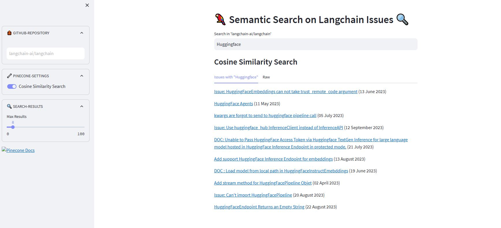

[](https://gh-semantic-search.streamlit.app/)
[](https://www.python.org/)
[](https://www.codefactor.io/repository/github/dcarpintero/github-semantic-search)
[](https://github.com/dcarpintero/st-newsapi-connector/blob/main/LICENSE)

# 🦜 Semantic Search on Langchain Github Issues with Pinecone 🔍

<p align="center">
  
</p>

##  🔍 What's Semantic Search?

> *Semantic search refers to search algorithms that consider the intent and contextual meaning of search phrases when generating results, rather than solely focusing on keyword matching. The goal is to provide more accurate and relevant results by understanding the semantics, or meaning, behind the query.*

## 📋 How does it work?

- **Ingesting Github Issues**: We use the [Langchain Github Loader](https://js.langchain.com/docs/modules/data_connection/document_loaders/integrations/web_loaders/github)  to connect to the [Langchain Repository](http://github.com/langchain-ai/langchain) and fetch the GitHub issues (nearly 500), which are then converted to a pandas dataframe and stored in a pickle file. See [./data-pipeline/ingest.py](./data-pipeline/ingest.py).

- **Generate and Index Vector Embeddings with Pinecone**: Pinecone generates vector embeddings at the object level (rather than for individual properties), it includes by default properties that use the text data type, in our case we skip the 'url' field (which will be also not filterable and not searchable) and set up the 'Hugging face' vectorizer. Given that our use case values fast queries over loading time, we have opted for the [HNSW](https://arxiv.org/abs/1603.09320) vector index type, which incrementally builds a multi-layer structure consisting from hierarchical set of proximity graphs (layers).


The ingestion follows in batches of 100 records:

```python
try:
        # Batch upload vectors
        batch_size = 100  # Adjust batch size to fit within 4MB limit
        vectors = []
        for item in df.itertuples():
            vector_id = item.url
            vector = item.embedding
            metadata = {
                "title": item.title,
                "description": item.description,
                "url": item.url,
                "labels": item.labels,
                "state": item.state,
                "creator": item.creator,
                "created_at": item.created_at,
            }
            vectors.append({"id": vector_id, "values": vector, "metadata": metadata})

            # If batch size is reached, upsert to Pinecone
            if len(vectors) >= batch_size:
                index.upsert(vectors)
                vectors = []  # Reset batch

        # Upsert remaining vectors if any
        if vectors:
            index.upsert(vectors)

        logging.info("Data successfully indexed.")
    except Exception as ex:
        logging.error(f"Unexpected Error: {ex}")
        raise
```

- **Searching with Pinecone**: Our App supports:

***Cosine-Similarity-Vector-Search***:

```python
@st.cache_data
def query_with_pinecone(_pc_client: Pinecone, query, index_name, embed_model, max_results=10) -> pd.DataFrame:
    """
    Search GitHub Issues in Pinecone with vector similarity (Cosine/Euclidean).
    """
    embed_model = LangchainEmbedding(
        HuggingFaceEmbeddings(model_name="sentence-transformers/all-mpnet-base-v2")
    )

    # Convert the query into an embedding vector
    query_vector = embed_model.get_text_embedding(query)

    # Perform the similarity search in Pinecone
    index = _pc_client  # Access the Pinecone index
    response = index.query(vector=query_vector, top_k=max_results, include_metadata=True)

    # Format the response into a DataFrame
    data = []
    for match in response["matches"]:
        data.append(
            {
                "title": match["metadata"]["title"],
                "url": match["metadata"]["url"],
                "labels": match["metadata"]["labels"],
                "description": match["metadata"]["description"],
                "created_at": match["metadata"]["created_at"],
                "state": match["metadata"]["state"],
                "score": match["score"],
            }
        )

    return pd.DataFrame.from_dict(data, orient="columns")
```

## 🚀 Quickstart

1. Clone the repository:
```
git clone https://github.com/Addika1630/semantic-search.git
```

2. Create and Activate a Virtual Environment:

```
Windows:

py -m venv .venv
.venv\scripts\activate

macOS/Linux

python3 -m venv .venv
source .venv/bin/activate
```

3. Install dependencies:

```
pip install -r requirements.txt
```

4. Ingest Data
```
python ./data-pipeline/ingest.py
```

5. Index Data
```
python ./data-pipeline/index.py
```

6. Launch Web Application

```
streamlit run ./app.py
```

## 👩‍💻 Streamlit Web App

Demo Web App deployed to [Streamlit Cloud](https://streamlit.io/cloud) and available at https://gh-semantic-search.streamlit.app/ 

## 📚 References

- [Langchain Document Loaders - Github](https://js.langchain.com/docs/modules/data_connection/document_loaders/integrations/web_loaders/github)
- [Pinecone Vector Search](https://www.kdnuggets.com/a-comprehensive-guide-to-pinecone-vector-databases)
- [Cosine Similarity Search](https://www.pinecone.io/learn/what-is-similarity-search/)

